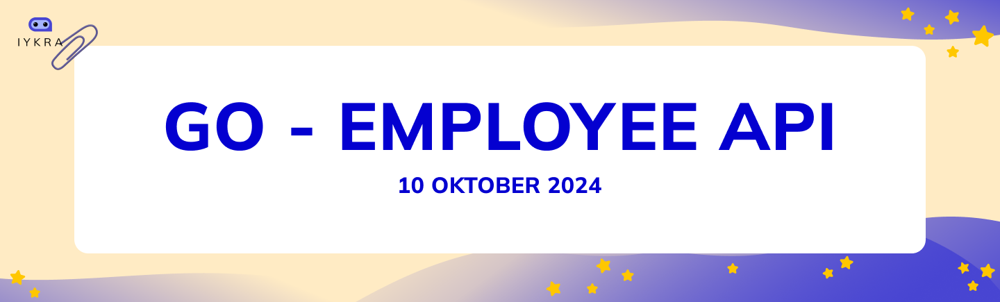

# Go - Employee App




## Setup
```
$ git clone https://github.com/adityaerlangga/employees-app
$ cd employees-app
```

```
DB_HOST=db # FOR RUNNING DOCKER
# DB_HOST=localhost # FOR LOCAL ENV
DB_USER=postgres
DB_PASSWORD=root
DB_NAME=db_employees
DB_PORT=5432
```

```
$ docker-compose up -d
```

| No | Task                              | Check             |
|:--:|----------------------------------|:-----------------:|
| 1  | Database Setup (Postgre SQL)    |        ✅         |
| 2  | API Implementation               |        ✅         |
| 3  | Dockerize the Application        |        ✅         |
| 4  | Deploy to Kubernetes             | Not Implemented   |
| 5  | Version Control with Github      |        ✅         |
| 6  | Bonus (Optional): Integrate Cloud Infrastructure |        ✅         |


### Routes:

https://www.postman.com/atom-pos/iykra-technical-test-aditya-erlangga-wibowo/overview

- URL Local: http://localhost:8080
- URL Cloud: https://iykra.adityaerlangga.my.id

  
    

|                          METHOD                          |              URL               |   Description   |
| :------------------------------------------------------: | :----------------------------: | :-------------: |
|            |  https://iykra.adityaerlangga.my.id/employees   |   GetAllEmployees   |
|            | https://iykra.adityaerlangga.my.id/employees/:id |   GetEmployeeByID   |
|            | https://iykra.adityaerlangga.my.id/employees/ |   CreateEmployee 
|          |   https://iykra.adityaerlangga.my.id/employees/:id   | UpdateEmployee |
 | https://iykra.adityaerlangga.my.id/employees/:id  | DeleteEmployee  |

### PAYLOAD

##### CREATE

```
{
    "name": "Aditya",
    "position": "Software Engineer",
    "salary": 20000
}
```

##### UPDATE (PARAMS ID)

```
{
    "name": "Aditya",
    "position": "Full Stack Engineer",
    "salary": 15000000
}
```

## Infra Spesifications

- Digital Ocean VPS RAM 2GB/1vCPU
- Ubuntu 20.04
- Domain Propagation
- Redirect HTTPS